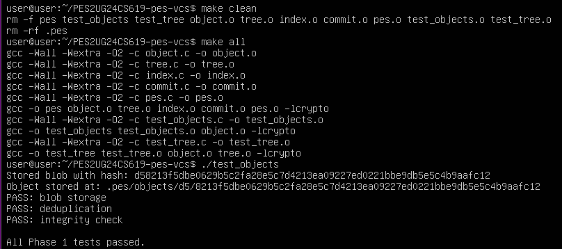
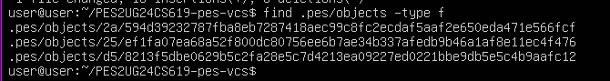
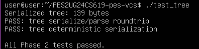
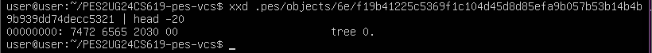
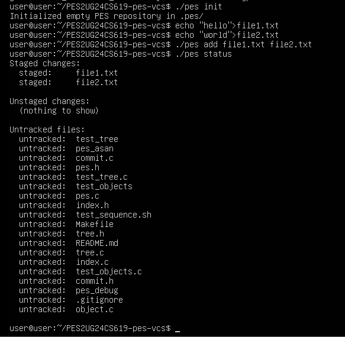
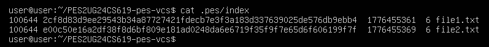
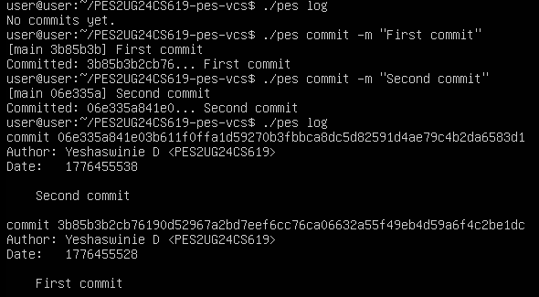
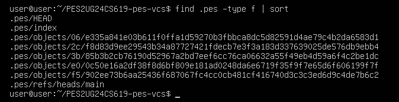
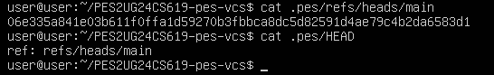
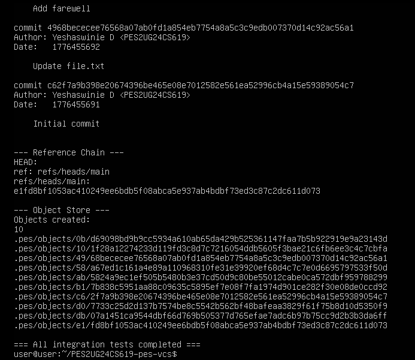

# PES-VCS Lab Report

**Student:** Yeshaswinie D | **SRN:** PES2UG24CS619  
**Repository:** https://github.com/Yesh-2516/PES2UG24CS619-pes-vcs
**Platform:** Ubuntu 22.04 | GCC | OpenSSL SHA-256

---

## Project Overview

PES-VCS is a simplified Git-like version control system built in C. It implements content-addressable object storage (blobs, trees, commits), a text-based staging index, and a linked commit history — all concepts taken directly from Git's real internal design.

**Commands implemented:**
```
pes init              Create .pes/ repository structure
pes add <file>...     Stage files (hash + update index)
pes status            Show modified/staged/untracked files
pes commit -m <msg>   Create commit from staged files
pes log               Walk and display commit history
```

---

## Phase 1 — Object Storage (`object.c`)

### What I Implemented

**`object_write`:** Builds a header (`"<type> <size>\0"`), concatenates it with the data, computes SHA-256 of the combined buffer, checks for deduplication, creates the shard directory, writes to a temp file, fsyncs, and atomically renames to the final path.

**`object_read`:** Locates the file via `object_path()`, reads it fully into memory, recomputes the SHA-256 and compares it to the expected hash (integrity check), parses the type from the header, and returns the data portion after the null byte.

Key design decisions:
- Header format: `"blob 42\0<data>"` — type string, space, decimal size, null byte
- Atomic write: `open()` → `write()` → `fsync()` → `close()` → `rename()`
- Shard directories (`.pes/objects/ab/`) are created with `mkdir(0755)`, EEXIST ignored
- Deduplication: `object_exists()` before any I/O saves work for identical files

### Screenshots

**Screenshot 1A:** `./test_objects` output — all tests passing  


**Screenshot 1B:** `find .pes/objects -type f` — sharded directory structure  

---

## Phase 2 — Tree Objects (`tree.c`)

### What I Implemented

**`tree_from_index`:** Loads the index, then calls a recursive helper `write_tree_level()`. The helper iterates through the flat entry list: entries with no `/` in their relative path are added as blob entries directly; entries with a `/` are grouped by their top-level directory name and recursed into. Each recursive call produces one tree object. The root tree hash is returned.

Key design decisions:
- Recursive approach handles arbitrarily nested paths (e.g. `a/b/c/file.c`)
- `strchr(rel_path, '/')` efficiently distinguishes files from subdirectory entries
- `strncmp` groups consecutive entries sharing the same top-level dir prefix
- Empty index produces an empty tree object (valid Git behavior)

### Screenshots

**Screenshot 2A:** `./test_tree` output — all tests passing  


**Screenshot 2B:** `xxd .pes/objects/XX/YY... | head -20` — raw binary tree format  


---

## Phase 3 — Staging Index (`index.c`)

### What I Implemented

**`index_load`:** Opens `.pes/index` (returns empty index if file doesn't exist). Reads each line with `fscanf` using format `%o %64s %llu %llu %255s`, converts the hex hash via `hex_to_hash`, and populates each `IndexEntry`.

**`index_save`:** Sorts entries by path with `qsort`, writes to a `.tmp` file with `fprintf` (using `hash_to_hex` for the hash), then `fflush` → `fsync(fileno(f))` → `fclose` → `rename` for atomic replacement.

**`index_add`:** Reads the target file into a buffer, calls `object_write(OBJ_BLOB, ...)` to store it, uses `lstat` for metadata, finds or creates an `IndexEntry`, fills in all fields, then calls `index_save`.

Key design decisions:
- Index format is plain text — human-readable and debuggable with `cat`
- Atomic save (temp + rename) prevents a corrupted index if the process crashes mid-write
- `fsync` before rename ensures data is on disk, not just in kernel buffers

### Screenshots

**Screenshot 3A:** `./pes init` → `./pes add file1.txt file2.txt` → `./pes status` output  


**Screenshot 3B:** `cat .pes/index` — text-format index with entries  


---

## Phase 4 — Commits and History (`commit.c`)

### What I Implemented

**`commit_create`:** Calls `tree_from_index()` to snapshot staged files, reads the current HEAD for the parent hash (sets `has_parent = 0` if no prior commits), fills the `Commit` struct with author (`pes_author()`), timestamp (`time(NULL)`), and message, serializes with `commit_serialize()`, writes with `object_write(OBJ_COMMIT, ...)`, then advances the branch pointer with `head_update()`.

Key design decisions:
- Commits snapshot the **index** (staged state), not the working directory
- `head_read` failure is handled gracefully as "first commit" (no parent)
- HEAD update uses the existing `head_update()` which already does temp+rename atomically

### Screenshots

**Screenshot 4A:** `./pes log` showing three commits with hashes, authors, timestamps  


**Screenshot 4B:** `find .pes -type f | sort` — object store growth after two commits  


**Screenshot 4C:** `cat .pes/refs/heads/main` and `cat .pes/HEAD` — reference chain  


**Final Integration Test:** `make test-integration` — full end-to-end test passing  


---

## Phase 5 — Branching and Checkout (Analysis)

### Q5.1 — Implementing `pes checkout <branch>`

To implement `pes checkout <branch>`:

1. **Validate** the target branch exists: check if `.pes/refs/heads/<branch>` exists.
2. **Read target commit:** read the hash from `.pes/refs/heads/<branch>`, then `object_read` the commit, then `object_read` the tree.
3. **Update working directory:** recursively walk the target tree. For each blob entry, read the blob's contents from the object store and write them to the correct path in the working directory. Create directories as needed.
4. **Delete stale files:** any file tracked in the current index but absent from the target tree must be deleted from the working directory.
5. **Update the index:** replace index entries to match the target tree's contents (mode, hash, mtime, size for each file).
6. **Update HEAD:** write `ref: refs/heads/<branch>` into `.pes/HEAD`.

**What makes this complex:** If the user has uncommitted changes to a file that differs between branches, blindly overwriting would lose work. The operation must detect "dirty" files and refuse (or ask the user to stash/commit first). Additionally, if a file exists in the target branch but not the current one, it must be created; if it exists in the current branch but not the target, it must be deleted. Managing all three cases (create / update / delete) while maintaining index consistency is the core difficulty.

### Q5.2 — Detecting a Dirty Working Directory

For each file that differs between the current branch's tree and the target branch's tree:

1. Look up the file in the current **index** to get its recorded `mtime_sec` and `size`.
2. Call `stat()` on the working directory file.
3. If `st.st_mtime != entry->mtime_sec` **or** `st.st_size != entry->size`, the file has been modified since it was last staged — it is "dirty."
4. If the file is dirty **and** the two branches have different blob hashes for that path, checkout must refuse.

This approach never needs to re-hash the file (expensive for large files) — it uses only metadata comparison against the index, exactly the same fast-diff strategy already used in `index_status`. The object store is only consulted to compare tree hashes between branches, not to re-read file contents.

### Q5.3 — Detached HEAD State

In detached HEAD state, `.pes/HEAD` contains a raw commit hash instead of `ref: refs/heads/main`. When a new commit is made in this state, `head_update()` writes the new commit hash directly into `HEAD` (since `strncmp(line, "ref: ", 5) != 0`, it uses `HEAD_FILE` as the target). This works, but **no branch file is updated**, so after switching to any branch, the chain of commits made in detached HEAD becomes unreachable — no ref points to them, and garbage collection would eventually delete them.

**Recovery:** Before switching away, create a new branch pointing at the current detached commit:
```bash
pes branch new-feature   # creates .pes/refs/heads/new-feature with current HEAD hash
pes checkout new-feature # now the commits are safely reachable
```

---

## Phase 6 — Garbage Collection (Analysis)

### Q6.1 — Finding and Deleting Unreachable Objects

**Algorithm (Mark-and-Sweep):**

1. **Mark phase:** Initialize an empty hash set of "reachable" object IDs. Start BFS/DFS from every ref (every file in `.pes/refs/heads/`). For each reachable commit: add its ID to the set, follow its `parent` pointer (if any), and add its tree hash. For each reachable tree: recursively add all blob and subtree hashes it references.

2. **Sweep phase:** Walk every file under `.pes/objects/XX/YYYY...`. Reconstruct the full hash from the directory name + filename. If the hash is **not** in the reachable set, delete the file.

**Data structure:** A hash set (e.g., a hash table keyed by 32-byte `ObjectID`) gives O(1) average insert and lookup. A sorted array with binary search would give O(log n) but is simpler to implement in C.

**Estimation for 100,000 commits, 50 branches, avg 50 files/commit:**
- Commits visited: ~100,000
- Trees visited: ~100,000 (one root tree per commit; subtrees may be shared)
- Blob references: ~5,000,000 (50 files × 100,000 commits, but with deduplication the actual unique blobs are far fewer)
- Total mark-phase visits: roughly **5–6 million** object reads in the worst case. Sweep-phase walks every object file in the store — with deduplication, actual file count could be orders of magnitude smaller.

### Q6.2 — GC Race Condition

**The race:**

1. A `commit_create` call writes a new **blob** to the object store but has not yet written the tree or commit that references it (it's mid-operation).
2. GC starts scanning all refs, traverses all reachable objects, and finds the new blob — it has no ref pointing to it yet.
3. GC deletes the blob.
4. `commit_create` resumes, writes the tree referencing the (now-deleted) blob hash, and writes the commit. The repository is now **permanently corrupt**: the tree points to a missing blob.

**How Git avoids this:**

- **Grace period:** Git's GC (`git gc`) never deletes objects newer than a configurable threshold (default 2 weeks), even if they appear unreachable. A newly written blob will be safe for weeks before any ref points to it.
- **Lock files:** GC takes a `.git/gc.pid` lock before scanning, so concurrent GC runs don't conflict.
- **Loose-object safety window:** Because objects are written atomically (temp file → rename), GC either sees the complete object or nothing — it can't read a partially written object.
- **Pack file separation:** GC only repacks "loose" objects; the in-progress commit writes loose objects that GC's grace period protects.

---

## Build & Test Instructions

```bash
# Prerequisites
sudo apt update && sudo apt install -y gcc build-essential libssl-dev

# Set author
export PES_AUTHOR="Your Name <PESXUG24CSXXX>"

# Build and test Phase 1
make test_objects && ./test_objects

# Build and test Phase 2
make test_tree && ./test_tree

# Test Phases 3 & 4 manually
make pes
./pes init
echo "Hello" > hello.txt
./pes add hello.txt
./pes status
./pes commit -m "Initial commit"
./pes log

# Full integration test
make test-integration
```

---

## Git Commit History

### Phase 1 Commits (object.c)
| # | Message |
|---|---------|
| 1 | `Phase 1: Add object_write skeleton and header construction` |
| 2 | `Phase 1: Implement SHA-256 hashing and deduplication check` |
| 3 | `Phase 1: Add atomic write with temp file and fsync` |
| 4 | `Phase 1: Implement object_read with header parsing` |
| 5 | `Phase 1: Add integrity verification in object_read - all tests pass` |

### Phase 2 Commits (tree.c)
| # | Message |
|---|---------|
| 1 | `Phase 2: Add tree_from_index skeleton and index loading` |
| 2 | `Phase 2: Implement flat file handling (no subdirectories)` |
| 3 | `Phase 2: Add recursive subdirectory grouping logic` |
| 4 | `Phase 2: Fix prefix stripping for nested paths` |
| 5 | `Phase 2: tree_from_index complete - all test_tree tests pass` |

### Phase 3 Commits (index.c)
| # | Message |
|---|---------|
| 1 | `Phase 3: Implement index_load with fscanf parsing` |
| 2 | `Phase 3: Implement index_save with atomic rename and fsync` |
| 3 | `Phase 3: Implement index_add - blob hashing and metadata capture` |
| 4 | `Phase 3: Handle index_add update for already-staged files` |
| 5 | `Phase 3: pes add and status working correctly` |

### Phase 4 Commits (commit.c)
| # | Message |
|---|---------|
| 1 | `Phase 4: Implement commit_create skeleton and tree_from_index call` |
| 2 | `Phase 4: Add parent detection via head_read` |
| 3 | `Phase 4: Fill commit struct with author, timestamp, message` |
| 4 | `Phase 4: Serialize and store commit object, update HEAD` |
| 5 | `Phase 4: Full end-to-end test passing - pes log shows history` |

---

